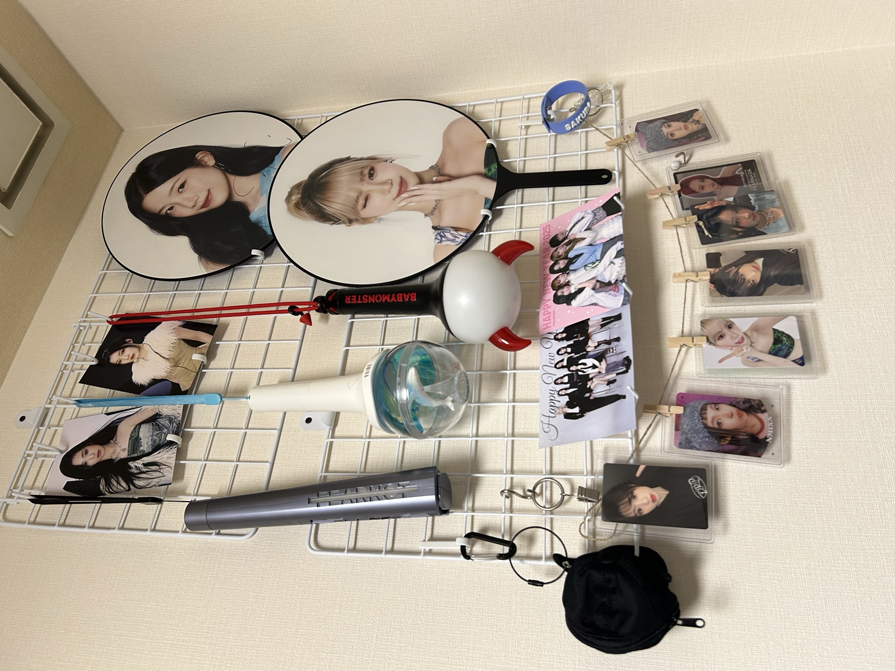

# 自己紹介: 服部 潤一（じゅん / じゅんちゃん）

## 基本情報

- 名前: 服部 潤一（はっとり じゅんいち）
- GitHub ID: junhat6
- 学科 / 学年: IT エキスパート学科 4 年

## 好きなこと・趣味

### ゲーム

- **Subnautica 2**（アーリーアクセス）をやっています
- **Core Keeper** にもハマり中
- 気になっているのは **FAREVER**（買い切り型・課金要素なしの王道 MMORPG）
  - 最近の課金ゲーっぽくない、買い切りで遊び切れるところに惹かれている

### K-POP

- **推し**: LE SSERAFIM の **チェウォン**
  - 首を痛めて活動休止中…早く戻ってきてほしい
- LE SSERAFIM のライブに参戦予定
- これまで行ったライブ: BABYMONSTER / ILLIT / aespa など
- ※ 最近はちょっと K-POP 熱が落ち着いてきています

部屋の壁の一部にオタグッズを飾っています。

Zoom 会議で背景をぼかしても、後ろの壁がうっすらザワついて
オタグッズ感が漏れ出てしまうのがたまにキズ…。

## 学んでいる技術・興味のある技術

### 今学んでいるもの

- **学校のチーム制作**: Vue + TypeScript（フロント）/ Go + Gin（バック）
  - バックエンド側が好き。ただし Go はまだ全然扱える気がしていない
- **Ruby on Rails**: 内定先で使うので勉強中

### 興味があるもの

- **Hono**（TypeScript の Web フレームワーク）
  - Cloudflare 上にまるごと載せてエッジコンピューティングできる
  - 動作がめちゃくちゃ早いので、次の個人開発で使ってみたい

## 最近作ったもの・触ったもの

最近はあまり大きいものは作れていないので、過去に作ったものを少し紹介します。

- **ユニガッチ**（2 年生 / Swift・iOS アプリ）
- **VoiceNoteLM**（3 年生 / React Native の Web アプリ）
  - 文字起こし + LLM を組み込んだ、トレンド意識のアプリ
- **AWS へのデプロイ経験**あり（冗長化構成は未経験）

得意領域はバックエンドですが、フロントもひと通り触れます（CSS の細かい調整は苦手…）。

## このコミュニティでやってみたいこと

運営として、参加してくれる皆さんの **お導き** ができたら嬉しいです。
Git / GitHub を入口にして、開発を楽しいと感じてもらえる場を一緒に作っていきましょう。
